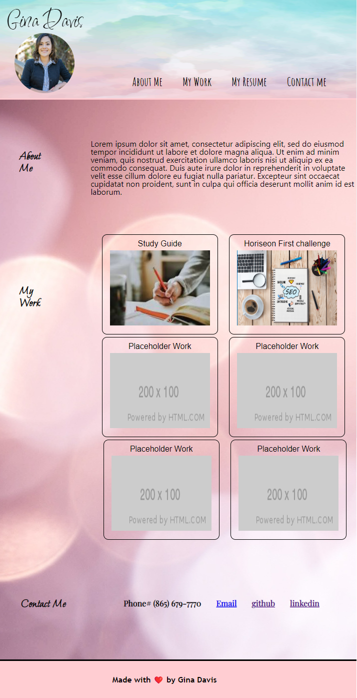

# Second Challenge Professional Portfolio

## Description

In the second challenge of the course I had to create a website from scratch, there was no starter code provided. 
I created a webpage with three main sections. The first section contains the name, picture of the author and the navigation bar. The second section contains information about the author and the professional portfolio. The third section is the contact information.

My motivation was to complete a finish product with a professional look from scratch, while learning to apply concepts learned in class such as the flexbox and css variables.

## Usage

My Professional Portfolio

Navigate through the webpage using the navigation bar located at the top of the page. "About Me" directs you to the first block of the page. "My Work" directs you to the demonstrations of work of the author as the "Study Guide" and the "Horiseon First Challenge", the rest of the cards are placeholders. "My Resume" directs you to the author's resume, and "Contact Me" directs you to the last block of the page with the author's contact information.

Link to the deployed app 

## License
MIT License

Copyright (c) [2022] [Gina Davis]

Permission is hereby granted, free of charge, to any person obtaining a copy of this software and associated documentation files (the "Software"), to deal in the Software without restriction, including without limitation the rights to use, copy, modify, merge, publish, distribute, sublicense, and/or sell copies of the Software, and to permit persons to whom the Software is furnished to do so, subject to the following conditions:

The above copyright notice and this permission notice shall be included in all copies or substantial portions of the Software.

THE SOFTWARE IS PROVIDED "AS IS", WITHOUT WARRANTY OF ANY KIND, EXPRESS OR IMPLIED, INCLUDING BUT NOT LIMITED TO THE WARRANTIES OF MERCHANTABILITY, FITNESS FOR A PARTICULAR PURPOSE AND NONINFRINGEMENT. IN NO EVENT SHALL THE AUTHORS OR COPYRIGHT HOLDERS BE LIABLE FOR ANY CLAIM, DAMAGES OR OTHER LIABILITY, WHETHER IN AN ACTION OF CONTRACT, TORT OR OTHERWISE, ARISING FROM, OUT OF OR IN CONNECTION WITH THE SOFTWARE OR THE USE OR OTHER DEALINGS IN THE SOFTWARE.